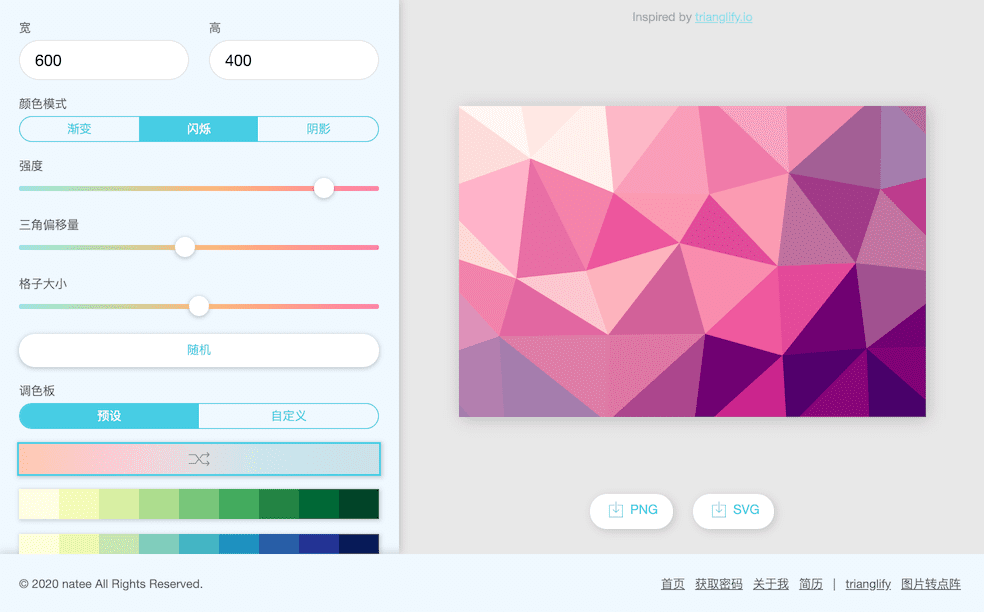
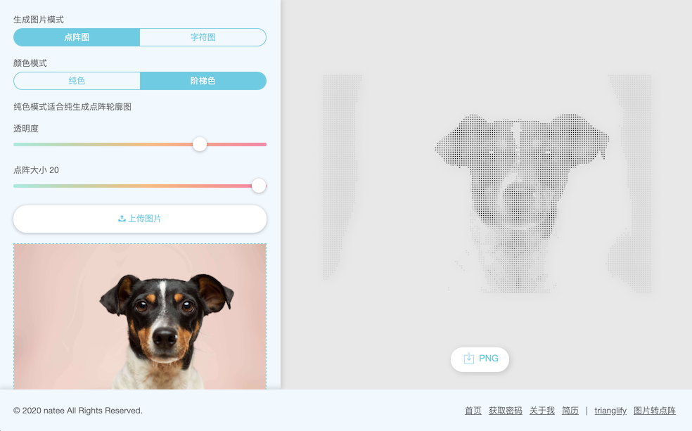
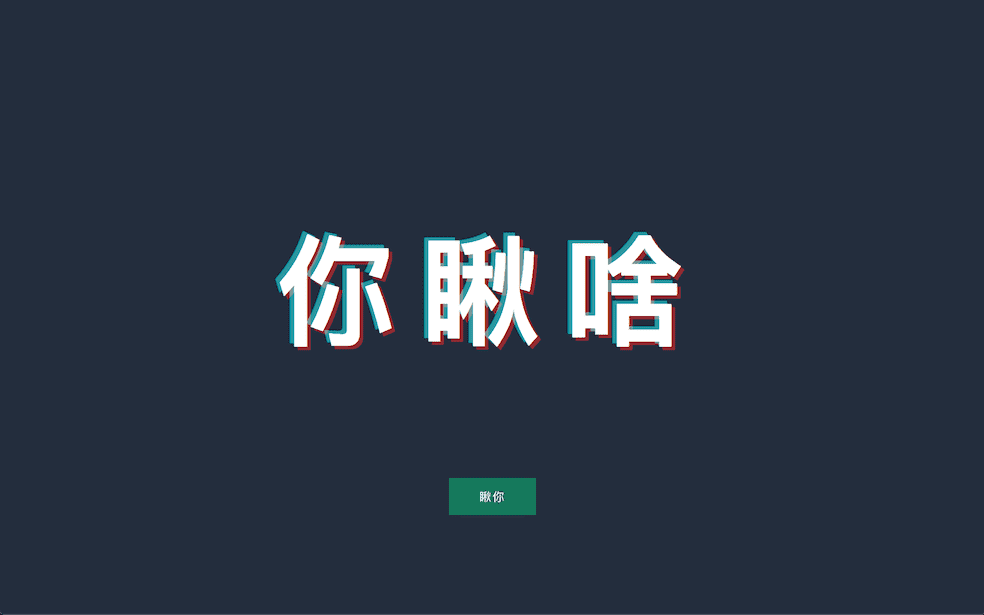
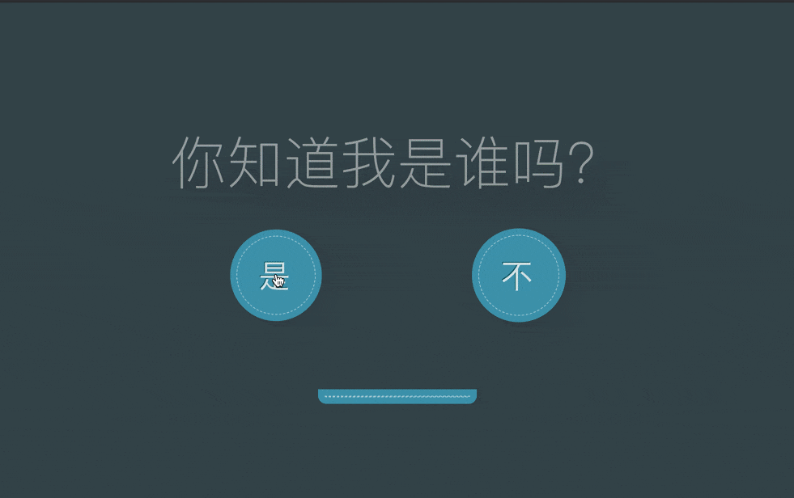
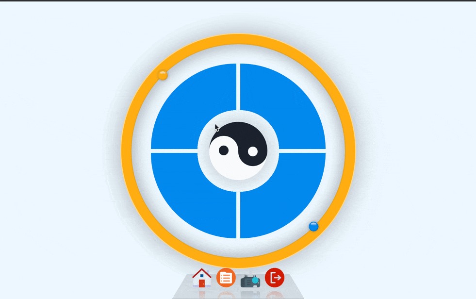
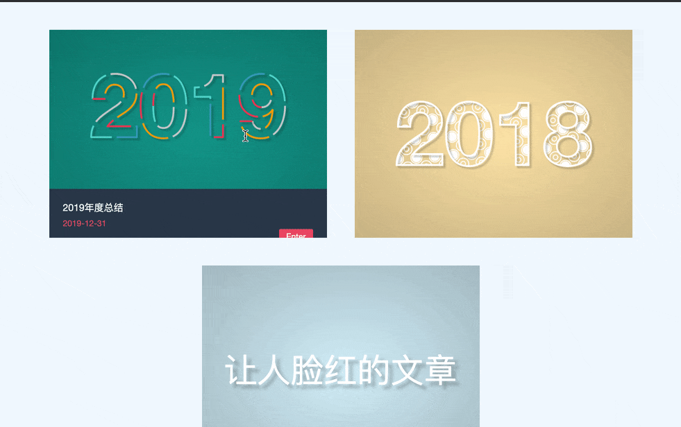

# website
一个不断变大的站点。

你可以直接使用游客密码 `zhangsan` 登陆，或者也可以从本站点寻找一个密码（当然也是游客权限）。

## 站点内容

### 小工具
- [生成随机三角纹理图形](http://natee.github.io/website/login.html#/trianglify)
  
  

- [图片转点阵图](http://natee.github.io/website/login.html#/image2text)
  
  
  

### 页面特效
- [新奇的登陆效果](http://natee.github.io/website/login.html#)
  
  

- [一份清晰的前端「简历」](https://natee.github.io/website/resume.html)
  
  
  
- [简约又舒爽的「文字动效」](https://natee.github.io/website/login.html#/aboutMe)
  
  
  
- [「抖音」效果的404](https://natee.github.io/website/login.html#/404)
  
  
  
- [获取登录密码指南](http://natee.github.io/website/login.html#/getPassword)

  

### 其它
- [旋转的太极](http://natee.github.io/website/index.html#/index)

  

- [炫酷的 SVG 动效](http://natee.github.io/website/presentation.html#/index)

  

- 待补充

### 系统
- [区分角色的「多页面」系统](https://natee.github.io/website/login.html)

## 站点配置

### 配色

关于我页面，选取了中国古典配色方案：

| 名称  |  色值 |
|------|------|
| 胭脂  |  `#9d2932` |
| 牙色  |  `#efdeb0` |
| 竹青  |  `#7879262` |
| 黛    |  `#494166` |
| 驼色  |  `#a88462` |
| 秋香色 |  `#d9b612` |

### 动画效果

选择了如下开源动画库：

- [animate.css](https://daneden.github.io/animate.css/)
- [anime](https://github.com/juliangarnier/anime/)

## TODO
- [ ] 代码升级至Vue 3.x版本
